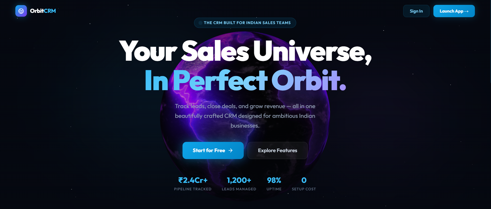
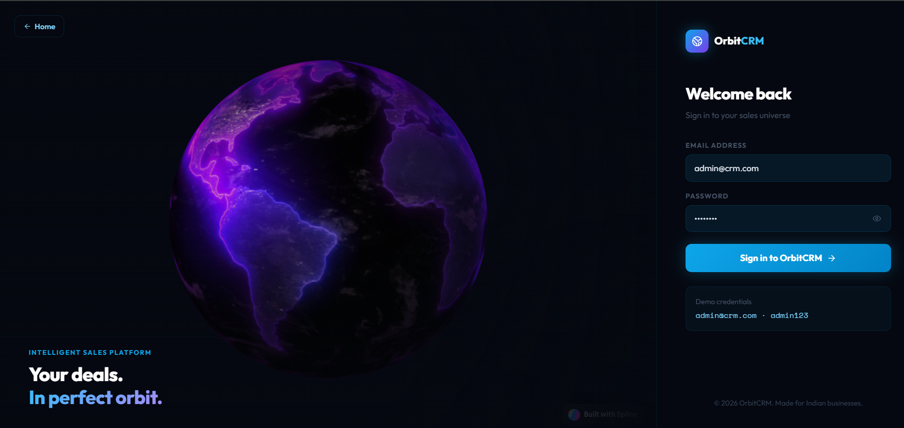
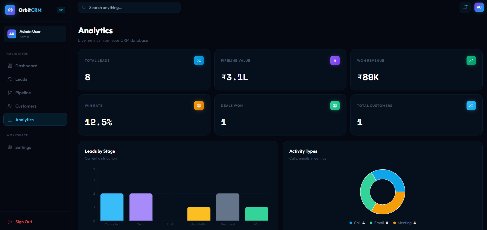

<div align="center">


# 🪐 OrbitCRM

### *Your Sales Universe, In Perfect Orbit.*

**A full-stack CRM built for ambitious Indian businesses — track leads, close deals, grow revenue.**

[](https://crm-1g8qoezre-pranithas-projects-c22e83ad.vercel.app/)
[](https://github.com/pranithamalasala/crm)
[]()
[]()

</div>

---

## 📸 Preview

| Landing Page | Login | Analytics Dashboard |
|:-----------:|:-----:|:-------------------:|
|  |  |  |

> **Demo credentials:** `admin@crm.com` / `admin123`

---

## ✨ Features

| Module | What it does |
|--------|-------------|
| 🔐 **Auth** | Secure login with persistent session via `sessionStorage` |
| 📊 **Analytics** | Live KPI dashboard — pipeline value, win rate, revenue, charts |
| 👥 **Leads** | Full CRUD, filtering, sorting, CSV export |
| 🗂 **Pipeline** | Kanban board with drag-and-drop stage transitions |
| 👤 **Customers** | Customer profiles with activity timeline |
| 📝 **Activities** | Log calls, emails, meetings with timestamps |
| 📱 **UI** | Fully responsive dark-theme interface |

---

## 🚀 Quick Start

### Prerequisites
- **Python 3.8+** and **Node.js 18+**

### 1. Clone the repo
```bash
git clone https://github.com/pranithamalasala/crm.git
cd crm
```

### 2. Start the Backend
```bash
cd backend
pip install -r requirements.txt
python run.py
```
> Runs at **http://localhost:5000**
> SQLite database (`crm.db`) is **auto-created** with seed data on first run — no MySQL or XAMPP needed.

### 3. Start the Frontend
```bash
cd frontend
npm install
npm run dev
```
> Runs at **http://localhost:5173**

### 4. Login
| Email | Password |
|-------|----------|
| `admin@crm.com` | `admin123` |

---

## 🏗 Tech Stack

### Frontend
- **React 18** + **Vite** — fast, modern build tooling
- **Tailwind CSS** — utility-first styling
- **React Router v6** — client-side routing
- **Recharts** — beautiful data visualizations
- **Lucide React** — icon system

### Backend
- **Flask 3** — lightweight Python web framework
- **flask-cors** — cross-origin resource sharing
- **bcrypt** — password hashing
- **python-dotenv** — environment config

### Database
- **SQLite** — zero-setup, file-based, auto-managed (`crm.db`)

---

## 🔌 API Reference

| Method | Endpoint | Description |
|--------|----------|-------------|
| `POST` | `/users/login` | Authenticate user |
| `GET` | `/leads` | Fetch all leads |
| `POST` | `/leads` | Create a new lead |
| `PUT` | `/leads/:id` | Update a lead |
| `DELETE` | `/leads/:id` | Delete a lead |
| `GET` | `/pipeline/board` | Get pipeline board view |
| `POST` | `/pipeline/move` | Move lead between stages |
| `GET` | `/customers` | Fetch all customers |
| `PUT` | `/customers/:id` | Update a customer |
| `DELETE` | `/customers/:id` | Delete a customer |
| `GET` | `/activities` | Fetch activity logs |
| `POST` | `/activities` | Log a new activity |
| `GET` | `/analytics` | Dashboard analytics data |

---

## 📁 Project Structure

```
crm/
├── backend/
│   ├── app/
│   │   ├── routes/          # leads, customers, pipeline, analytics...
│   │   └── models/          # DB schema & queries
│   ├── crm.db               # SQLite DB (auto-generated)
│   ├── requirements.txt
│   └── run.py
├── frontend/
│   ├── src/
│   │   ├── components/      # Reusable UI components
│   │   ├── pages/           # Dashboard, Leads, Pipeline, Analytics...
│   │   └── api/             # API client functions
│   ├── package.json
│   └── vite.config.js
└── README.md
```

---

## 👥 Contributors

<table>
  <tr>
    <td align="center">
      <a href="https://github.com/pranithamalasala">
        <b>Pranitha</b><br/>
        <sub>Frontend & Integration</sub>
      </a>
    </td>
    <td align="center">
      <a href="https://github.com/sushantbhatt17">
        <b>Sushant Bhatt</b><br/>
        <sub>Backend & Database</sub>
      </a>
    </td>
  </tr>
</table>

---

## 🗺 Roadmap

- [ ] JWT-based authentication
- [ ] Role-based access control (Admin / Sales Rep)
- [ ] Email notifications & reminders
- [ ] Real-time activity updates
- [ ] Cloud deployment guide (Docker / AWS)
- [ ] Mobile app (React Native)

---

## 🤝 Contributing

Pull requests are welcome! For major changes, please open an issue first to discuss what you'd like to change.

```bash
# Fork → Clone → Branch → Commit → Push → PR
git checkout -b feature/your-feature-name
git commit -m "feat: add your feature"
git push origin feature/your-feature-name
```

---

## 📄 License

This project is open-source and available under the [MIT License](LICENSE).

---

<div align="center">

**Built with ❤️ for Indian Sales Teams**

⭐ Star this repo if you found it useful!

[](https://github.com/pranithamalasala/crm)

</div>
